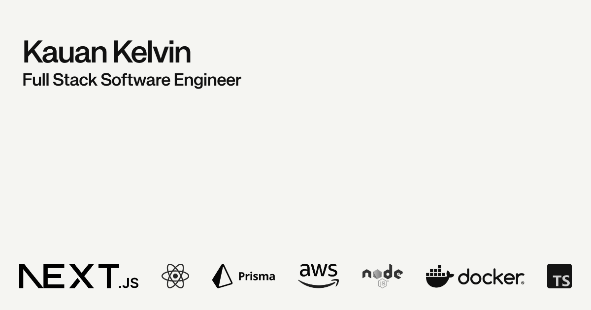

# Kauan Kelvin | Full Stack Software Engineer

A high-performance, neo-brutalist portfolio built to showcase technical craft, scalable architecture, and immersive user experiences.

## Technical Overview

This project is not just a static site; it's a demonstration of modern web engineering principles. It features a custom internal design system, hardware-accelerated animations, and edge-first analytics, all while maintaining strict adherence to Core Web Vitals and accessibility standards.

### Core Stack
* **Framework:** Next.js (App Router)
* **Language:** TypeScript
* **Styling:** Tailwind CSS v4 (Custom Neo-brutalist Theme)
* **Motion & Physics:** GSAP (ScrollTrigger, Custom Easing) & SplitType
* **Analytics:** Vercel Analytics (Privacy-first, edge-rendered)

## Key Features

* **Advanced Masked Text Reveal:** Custom GSAP implementations for line-by-line staggered typography animations, replicating Awwwards-winning editorial motion.
* **Complex Scroll Topologies:** Bottom-spacer parallax reveals and sticky stacking contexts engineered without layout thrashing.
* **Fluid Typography:** Implementation of CSS `clamp()` functions for seamless scaling across viewports without breakpoint jumps.
* **Internationalization (i18n):** Native multi-language support (EN/PT) with persistent layout state.
* **Zero-FOUC Architecture:** Server-Side Rendering (SSR) optimized to prevent flashes of unstyled content before JavaScript hydration.

## Local Development

Clone the repository and install dependencies using `pnpm`:

\`\`\`bash
git clone https://github.com/kauannkelvinn/portfolio-v2.git
cd portfolio-v2
pnpm install
\`\`\`

Start the development server:

\`\`\`bash
pnpm dev
\`\`\`

## Deployment
Continuous Integration and Deployment are handled via GitHub Actions and Vercel. The production environment is configured with strict security headers and custom DNS mapping.